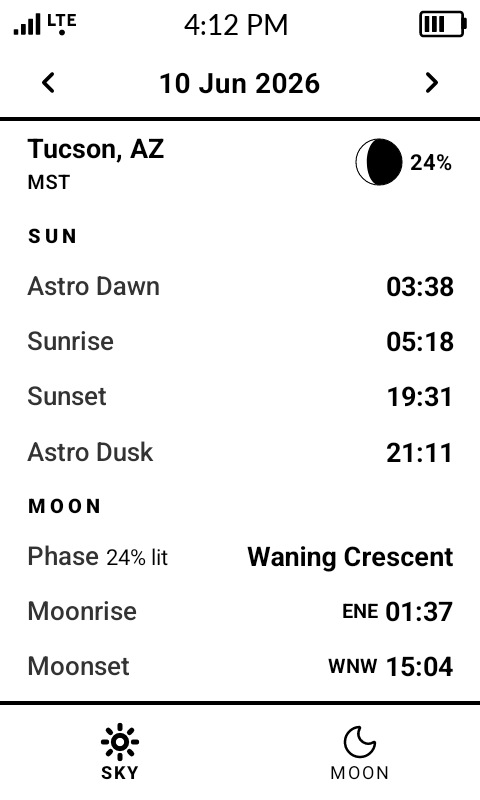
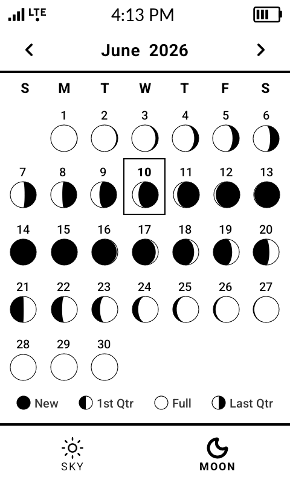
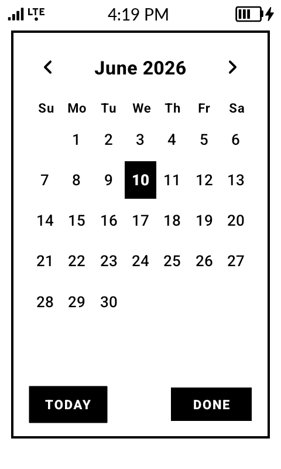
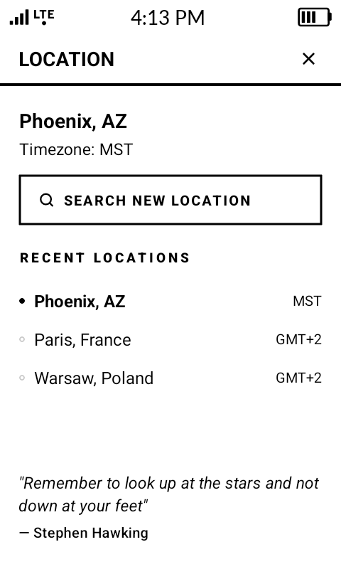

# AstroWatch

AstroWatch is a lightweight astronomy app designed for e-ink display on the Mudita Kompakt. 

## Mindful Design

AstroWatch was designed specifically for the Mudita Kompakt, as an intentional, minimalistic tool providing useful info that encourages users to spent more time enjoying the natural world and less time on their phone. 

Key design decisions include:

- No advertisements
- No notifications
- No accounts or sign-in requirements
- No location tracking or GPS dependency
- Offline operation after location selection
- Minimal visual clutter
- Optimized for the Mudita Kompakt e-ink display

## Why AstroWatch?

Many astronomy applications are designed for smartphones with vibrant animations, extensive menus, and complex features.

AstroWatch instead focuses on the information most frequently needed by casual stargazers, astrophotographers, and outdoor enthusiasts:

- Sunrise and sunset
- Moonrise and moonset
- Lunar phase
- Astronomical darkness

By presenting helpful information in a concise layout, AstroWatch remains easy to use on e-paper devices like the Mudita Kompakt.

## Feature List

- Sunrise and sunset times
- Astronomical dawn and dusk times
- Moonrise and moonset times & direction
- Current Lunar phase & monthly calendar
- Worldwide location support
- Offline support for up to 3 locations
- Manual location input - no tracking
- E-ink optimized interface
  

## Installation

Download the latest APK from the Releases section of this repository.

## Screenshots

<table>
  <tr>
    <td align="center">
       
    </td>
    <td align="center">
       
    </td>
  </tr>
  <tr>
    <td align="center">
       
    </td>
    <td align="center">
       
    </td>
  </tr>
</table>

## Navigation

- Tap the moon icon on the Sky tab to open the Moon tab.
- Tap the sun icon on the Moon tab to return to the Sky tab.
- Tap the date at the top of the Sky tab to open the calendar.
- Tap Today in the calendar to return to the current date.
- Tap the month name at the top of the Moon tab to return to the current month.
- Tap the location name to choose a different location.

## FAQ

<table>
  <tr>
    <th>Question</th>
    <th>Answer</th>
  </tr>

  <tr>
    <td>Does AstroWatch work offline?</td>
    <td>
      Yes. Once a location has been selected, astronomical calculations work without an internet connection. The app saves your three most recent locations, so they can all be accessed offline.
    </td>
  </tr>

  <tr>
    <td>Is my location being tracked?</td>
    <td>
      No. Locations are selected manually rather than using the device's GPS.
    </td>
  </tr>

  <tr>
    <td>What is Astro Dawn and Astro Dusk?</td>
    <td>
      Astronomical dusk is the instant, well after sunset, when the center of the Sun dips to 18 degrees below the horizon. Astronomical dawn occurs at the moment, well before sunrise, when the center of the Sun rises above 18 degrees below the horizon. The darkest period of night occurs between astronomical dusk and dawn.
    </td>
  </tr>

  <tr>
    <td>Why do some locations show "No Astro Night"?</td>
    <td>
      Some locations do not reach astronomical darkness (sun 18 degrees below the horizon) during parts of the year.
    </td>
  </tr>

  <tr>
    <td>Why can moonset appear above moonrise?</td>
    <td>
      Events are displayed in chronological order. On some dates, the moon sets before it rises later that day.
    </td>
  </tr>

  <tr>
    <td>What do the letters next to the moonrise and moonset times indicate?</td>
    <td>
      The letters indicate the direction of the moonrise and moonset. For example, "N" is north and "WSW" is west-southwest.
    </td>
  </tr>

</table>

## Technical Notes

- Built with Expo and React Native
- Designed for the Mudita Kompakt
- Open source under the MIT License
- Source code and issue tracking available in this repository

## License

MIT License
